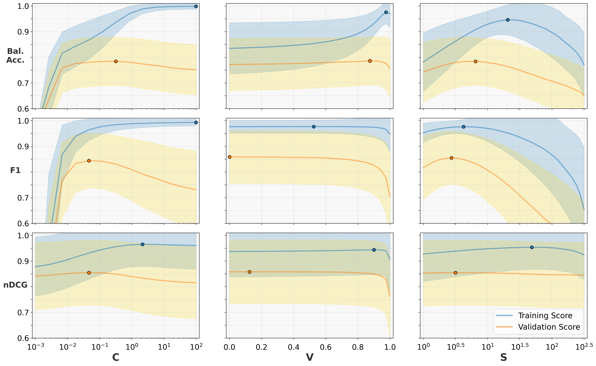
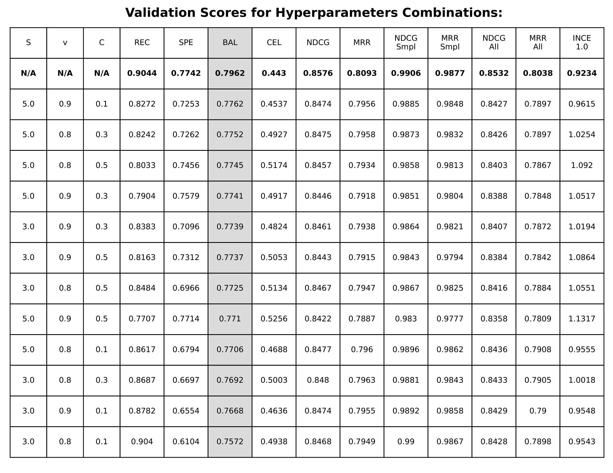
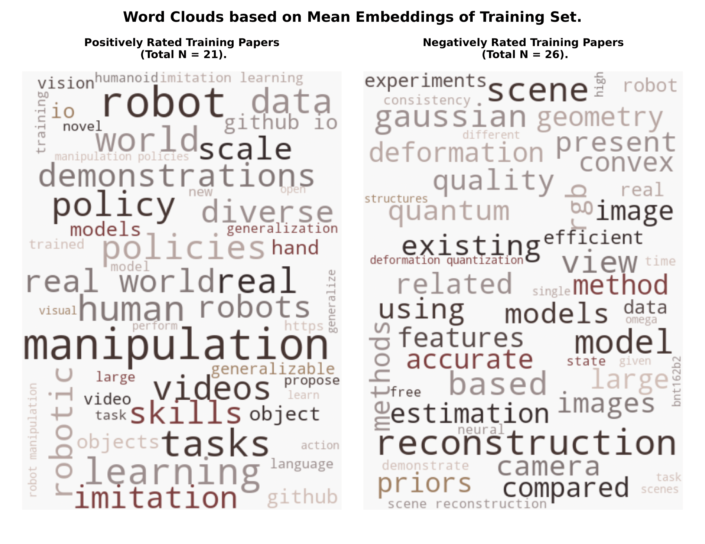
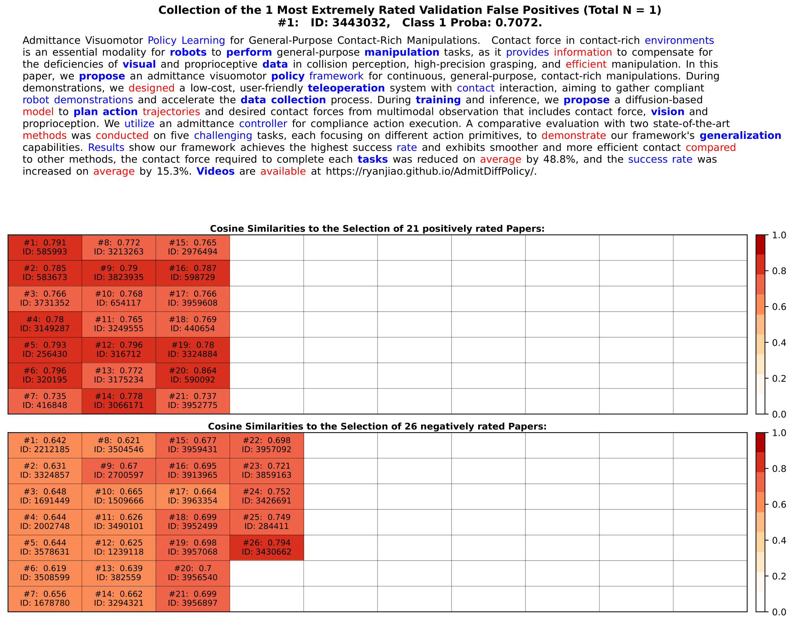

# I. Embedding Models

We provide code for automatically computing and evaluating papers embeddings for the following text embedding models:
- **specter2_base:** Model Size 0.1B parameters, Dimension 768.
- **gte-base-en-v1.5:** Model Size 0.1B parameters, Dimension 768.
- **gte-large-en-v1.5:** Model Size 0.4B parameters, Dimension 1024.
- **Qwen3-Embedding-0.6B:** Model Size 0.6B parameters, Dimension 1024.
- **Qwen3-Embedding-4B:** Model Size 4B parameters, Dimension 2560.
- **Qwen3-Embedding-8B:** Model Size 7B parameters, Dimension 4096.

Here is an overview of their results (256-dimensional with 100-dimensional category embeddings attached):

## Cross-Validation

| Model Name | Bal. Acc. | NDCG | MRR | InfoNCE |
|------------|------------------|------|-----|---------|
| tf-idf | 73.65 | 81.92 | 75.88 | 1.3559 |
| specter2_base | 76.92 | 84.61 | 79.43 | 0.9540 |
| gte-base-en-v1.5 | 77.16 | 84.70 | 79.55 | 0.9571 |
| gte-large-en-v1.5 | 77.66 | 85.14 | 80.14 | 0.9334 |
| Qwen3-Embedding-0.6B | 77.43 | 85.12 | 80.11 | 0.9273 |
| Qwen3-Embedding-4B | **78.99** | **86.67** | **82.18** | 0.8477 |
| Qwen3-Embedding-8B | 78.93 | **86.67** | **82.18** | **0.8467** |

## Session-based Evaluation

| Model Name | Bal. Acc. | NDCG | MRR | InfoNCE |
|------------|------------------|------|-----|---------|
| tf-idf | 63.88 | 73.74 | 65.18 | 1.8139 |
| specter2_base | 71.35 | 80.43 | 73.93 | 1.1770 |
| gte-base-en-v1.5 | 70.56 | 79.72 |73.00 | 1.2229 |
| gte-large-en-v1.5 | 71.12 | 80.44 | 73.95 | 1.1923 |
| Qwen3-Embedding-0.6B | 71.07 | 80.25 | 73.68 | 1.1790 |
| Qwen3-Embedding-4B | 73.35 | 82.70 | 76.93 | 1.0650 |
| Qwen3-Embedding-8B | **73.67** | **83.03** | **77.37** | **1.0385** |

## Test Users

## Session-based Evaluation

| Model Name | NDCG | NDCG CS | NDCG Non-CS
|------------|------------------|------|-----|
| gte-large-en-v1.5 | 80.84 | 80.91 | 78.99 |
| gte-large-en-v1.5 fine-tune | 83.14 | 83.25 | 80.16 |
| Qwen3-Embedding-8B | 83.20 | 83.22 |82.62 |


# II. Experiment Setup
To evaluate the recommender performance with specialized settings, create an examplary config file by running (from the root directory):
```bash
python -m code.scripts.create_example_configs
```
You may then inspect and alter the settings in `code/logreg/experiments/example_configs/example_config.json`.
Here is an overview of the possible settings:
#### 1) Users Selection & Evaluation
- **users_selection:** String default: "finetuning_test".
Select a subset of users on which the experiments are performed. The default "finetuning_test" automatically chooses 500 fixed users with sufficiently many votes. Other options are "finetuning_val", "random" or explicitly entering a list of IDs such as [9, 13, 21]. 
But if `--all_papers` was NOT set while computing the paper embeddings, this value has to remain at "finetuning_test" (other users might have voted on papers for which no embeddings were computed).
- **take_complement_of_users:** Bool default: False.
Among all users meeting the requirements (see below), select exactly those that were NOT specified.
- **evaluation:** String default: "cross_validation".
The default "cross_validation" performs a random shuffle of the user voting data with 5-fold cross-validation. Other options are "train_test_split" (another random shuffle but only for a single split) and "session_based" (a temporal split so that training is done on the oldest voting data and evaluation on the most recent ratings).
- **test_size:** Float default: 0.2.
Percentage of user votes selected for validation. When selecting evaluation: "session_based", the algorithm performs the split at the session which brings the validation share closest to this value.
- **stratified:** Bool default: True.
Decides whether training and validation set should have the same positive/negative ratio when selection evaluation: "cross_validation" or "train_test_split". Without it, there is a risk of users not having enough positive or negative labels and being skipped (for both training and evaluation).

Next are multiple options used to specify minimum requirements for users to be considered when choosing users_selection: "random" (otherwise ignored).
- **max_users:** Integer default: 500.
An upper bound for the number of users to be selected.
- **min_n_posrated / min_n_negrated:** Integer default: 20.
These refer to the required numbers of upvotes and downvotes when specifying evaluation: "cross_validation" or "train_test_split". Ignored for "session_based".
- **min_posrated_train / min_n_negrated_train:** Integer default: 16.
These refer to the required numbers of upvotes and downvotes in the training set when entering evaluation: "session_based". Since temporal splits are based on sessions, this is needed to avoid having users for which all ratings were performed during just a single session (so the training or validation set would end up too small).
- **min_posrated_val / min_n_negrated_val:** Integer default: 5.
Analogously but refering to the sample size in the validation split.

#### 2) Miscellanous
- **users_random_state:** Integer default: 42.
The seed when randomly drawing a subset of users by specifying users_selection: "random". Ignored otherwise.
- **model_random_state:** Integer default: 42.
The seed passed to sklearn's LogisticRegression. It is also used for generating train/test splits (for a single split and during cross-validation). If `--all_papers`was NOT set while computing embeddings, this value has to lie in the list
[1, 2, 25, 26, 42, 75, 76, 100, 101, 150, 151].
- **cache_random_state:** Integer default: 42.
The seed used to randomly select a subset of paper IDs from the total 100K cache for training negatives. Same restrictions as for model_random_state.
- **ranking_random_state:** Integer default: 42.
The seed used to randomly select 4 actual negatives and additional simple negatives to evaluate ranking performance. The simple negatives are drawn from research categories untypical for the Scholar Inbox users. Same restrictions as for model_random_state.
- **save_users_predictions:** Bool default: false.
When set to True, the program will store all the model predictions made during the run in .json files. This is generally not necessary and costs additional storage, but enables more detailed visualizations.
- **save_users_coefs:** Bool default: false.
When set to True, the program will store all the trained logistic regression coefficients in .npy files. This is generally not necessary and costs additional storage, but enables using them as a starting point for further processing.
- **load_users_coefs:** Bool default: false.
When set to True, the program will skip training and instead use the coefficients provided under **users_coefs_path** (String default: null) for evaluation.
-- **n_jobs:** integer default: -1.
The number of users to be processed in parallel. By default, it takes all cores.

#### 3) Hyperparameters
For the following settings, you can enter single values or lists. In case of lists, all possible combinations of hyperparameters will be tried.
- **clf_C:** Float default: 0.1.
The inverse regularization strength. A strong value for TF-IDF is 0.4.
- **weights_cache_v:** Float default: 0.9.
The importance of the actual downvotes compared to the random cache negatives. A strong value for TF-IDF is 0.9.
- **weights_neg_scale:** Float default: 5.0.
A scaling factor applied to all negative samples. A strong value for TF-IDF is 1.0.

#### 4) Embedding
Lastly, specify the path to the folder containing the embeddings matrix under **embedding_folder**.

# III. Running Experiments & Visualization
To run the experiments, simply specify the path to the config file (again all from the root directory)
```bash
python -m code.scripts.logreg_run --config_path code/logreg/experiments/example_configs/example_config.json
```
Alternatively, you may automatically run the same experiments multiple times over different random seeds and average the results. For this case, specify one specific config file and the program will then automatically copy it and change the seeds.
```bash
python -m code.scripts.logreg.logreg_average_seeds --config_path code/logreg/experiments/example_configs/example_config.json
```
This will create a pdf-file containing detailed results under `code/logreg/outputs/example_config/global_visu_bal.pdf`.
If you want more detailed visualizations for individual users, you may run (but only possible if you specified save_users_predictions: true beforehand):

```bash
python -m code.logreg.src.visualization.visualize_users --outputs_folder code/logreg/outputs/example_config --users 46 110 6792
```
Note that these visualizations require a lot of time and are therefore not done automatically for all users. Examples are shown below:


### Hyperparameter Ablation Study


### Global Performance Study Overview



### Single User Performance Study Overview



